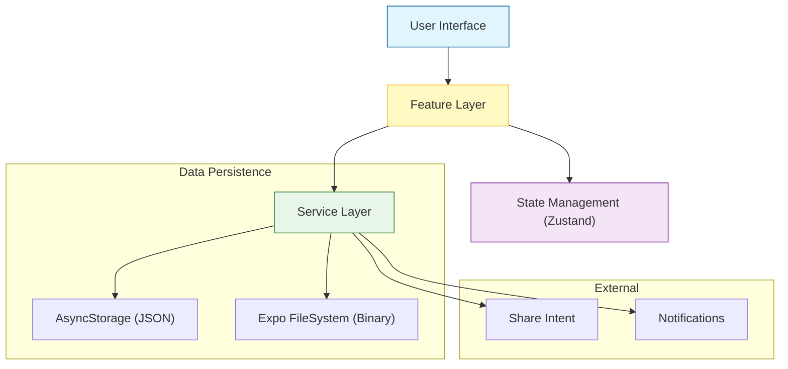
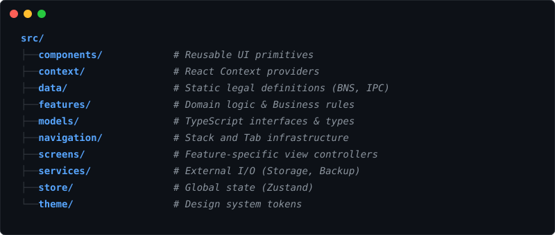

**Next-Generation Legal Practice Management System**


---

## Executive Summary

**Advocat** is a high-performance, offline-first mobile application designed to modernize legal practice management. Engineered for seamless operation in courtrooms and chambers without reliable internet, it provides a secure, encrypted environment for case files, deadline management, and legal research. It natively supports the new Indian legal codes (BNS, BNSS, BSA) while maintaining backward compatibility with legacy acts (IPC, CrPC, IEA).

### Technical Architecture

The application is built on a **Clean Architecture** principle, separating concerns into robust layers for scalability and maintainability.



## Technology Stack

The application uses a modern, type-safe stack designed for scalability and performance.

| Category | Technology | Architecture Decision |
| :--- | :--- | :--- |
| **Core Framework** |  | Chosen for native performance and cross-platform code sharing (~95%). |
| **Runtime** |  | Managed workflow for rapid OTA updates and simplified build pipelines. |
| **Language** |  | Enforces strict type safety to prevent runtime errors in critical legal contexts. |
| **State** |  | Micro-state management that is 40x lighter than Redux with zero boilerplate. |
| **Navigation** |  | Native screen primitives ensuring smooth transitions and deep linking support. |
| **Storage** |  | Persistent encrypted key-value storage for offline case data. |
| **File System** |  | Handles binary document storage, caching, and base64 encoding for backups. |
| **Date Time** |  | Immutable date library for precise deadline calculations and timezones. |

## Core Capabilities

### 1. Intelligent Case Management
Comprehensive lifecycle tracking from **Intake** to **Appeal**.
*   **Multi-Stage Tracking**: Granular status updates across 10+ distinct legal stages.
*   **Legal Code Integration**: Built-in support for BNS, BNSS, IPC, and CrPC.
*   **Timeline Visualization**: Automated chronological history of every case event.

### 2. Smart Deadline Engine
A proactive scheduling system designed to prevent missed filings.
*   **Urgency Algorithms**: Automated classification of tasks into **Critical**, **High**, and **Medium**.
*   **Custom Notifications**: Configurable alert triggers (Same Day, 24h, 72h) ensuring multi-layered reminders.

### 3. Secure Document Vault
Enterprise-grade document handling.
*   **Offline-First**: Documents encrypted locally, accessible without internet.
*   **Secure Sharing**: Intelligent MIME-type detection for safe external sharing.
*   **Full Backup**: JSON-based backup system including base64 encoded files.

## Project Structure

A clean, feature-driven architecture ensures maintainability.



## Installation

1.  **Clone the repository**
    ```bash
    git clone https://github.com/santhosh-reddy/advocat.git
    cd advocat
    ```

2.  **Install dependencies**
    ```bash
    npm install
    ```

3.  **Start Development**
    ```bash
    npx expo start
    ```

## Developer Credits


---
*© 2024 Advocat. All Rights Reserved.*
